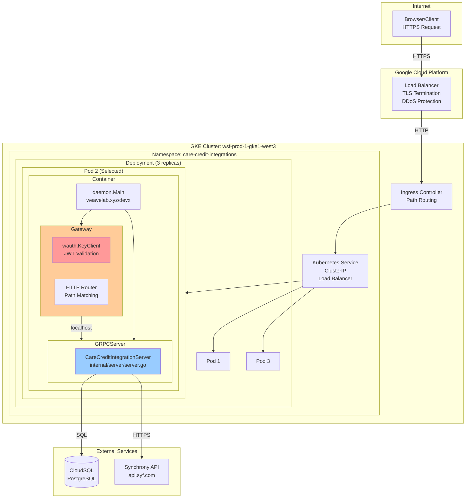

```mermaid
graph TB
    subgraph Internet
        Client[Browser/Client<br/>HTTPS Request]
    end
    
    subgraph GCP["Google Cloud Platform"]
        LB[Load Balancer<br/>TLS Termination<br/>DDoS Protection]
    end
    
    subgraph GKE["GKE Cluster: wsf-prod-1-gke1-west3"]
        Ingress[Ingress Controller<br/>Path Routing]
        
        subgraph Namespace["Namespace: care-credit-integrations"]
            Service[Kubernetes Service<br/>ClusterIP<br/>Load Balancer]
            
            subgraph Deployment["Deployment (3 replicas)"]
                Pod1[Pod 1]
                Pod2[Pod 2]
                Pod3[Pod 3]
            end
            
            subgraph Pod2["Pod 2 (Selected)"]
                Container[Container<br/>care-credit-integrations:v1.2.3]
                
                subgraph Container
                    Daemon[daemon.Main<br/>weavelab.xyz/devx]
                    Gateway[HTTP Gateway :8080<br/>schema-gen-go]
                    GRPCServer[gRPC Server :9090<br/>Internal Only]
                    
                    subgraph Gateway
                        AuthClient[wauth.KeyClient<br/>JWT Validation]
                        Router[HTTP Router<br/>Path Matching]
                    end
                    
                    subgraph GRPCServer
                        ServerImpl[CareCreditIntegrationServer<br/>internal/server/server.go]
                    end
                end
            end
        end
    end
    
    subgraph External["External Services"]
        CloudSQL[(CloudSQL<br/>PostgreSQL)]
        SynchronyAPI[Synchrony API<br/>api.syf.com]
    end
    
    Client -->|HTTPS| LB
    LB -->|HTTP| Ingress
    Ingress --> Service
    Service --> Pod1
    Service --> Pod2
    Service --> Pod3
    
    Daemon --> Gateway
    Daemon --> GRPCServer
    Gateway -->|localhost| GRPCServer
    
    ServerImpl -->|SQL| CloudSQL
    ServerImpl -->|HTTPS| SynchronyAPI
    
    style AuthClient fill:#ff9999
    style ServerImpl fill:#99ccff
    style Gateway fill:#ffcc99
```