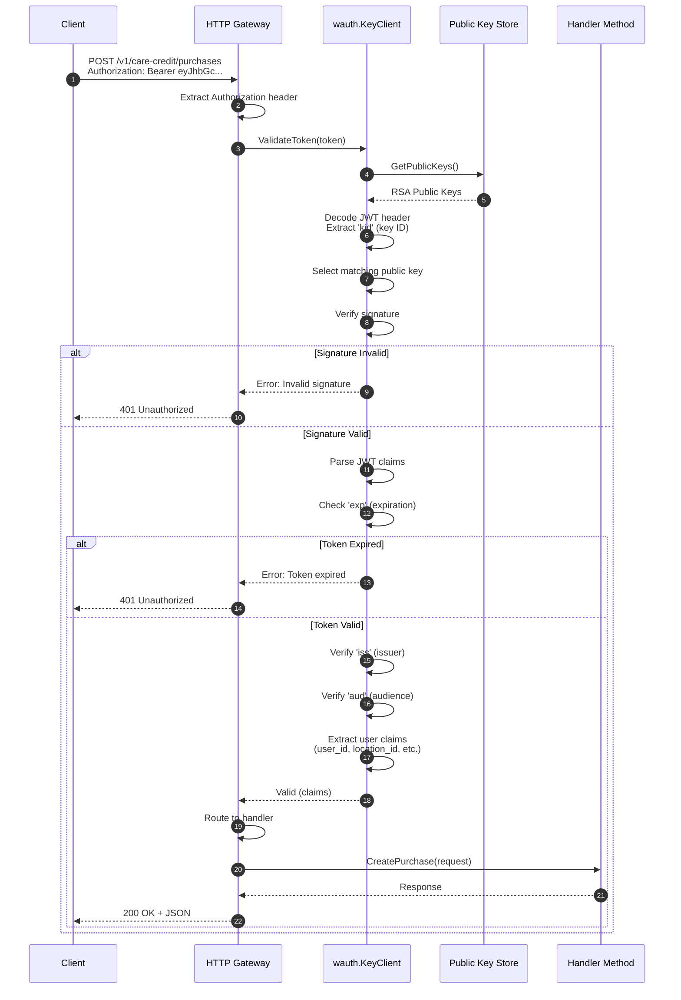

```mermaid
sequenceDiagram
    autonumber
    participant Client
    participant Gateway as HTTP Gateway
    participant Auth as wauth.KeyClient
    participant KeyStore as Public Key Store
    participant Handler as Handler Method

    Client->>Gateway: POST /v1/care-credit/purchases<br/>Authorization: Bearer eyJhbGc...
    
    Gateway->>Gateway: Extract Authorization header
    Gateway->>Auth: ValidateToken(token)
    
    Auth->>KeyStore: GetPublicKeys()
    KeyStore-->>Auth: RSA Public Keys
    
    Auth->>Auth: Decode JWT header<br/>Extract 'kid' (key ID)
    Auth->>Auth: Select matching public key
    Auth->>Auth: Verify signature
    
    alt Signature Invalid
        Auth-->>Gateway: Error: Invalid signature
        Gateway-->>Client: 401 Unauthorized
    else Signature Valid
        Auth->>Auth: Parse JWT claims
        Auth->>Auth: Check 'exp' (expiration)
        
        alt Token Expired
            Auth-->>Gateway: Error: Token expired
            Gateway-->>Client: 401 Unauthorized
        else Token Valid
            Auth->>Auth: Verify 'iss' (issuer)
            Auth->>Auth: Verify 'aud' (audience)
            Auth->>Auth: Extract user claims<br/>(user_id, location_id, etc.)
            
            Auth-->>Gateway: Valid (claims)
            Gateway->>Gateway: Route to handler
            Gateway->>Handler: CreatePurchase(request)
            Handler-->>Gateway: Response
            Gateway-->>Client: 200 OK + JSON
        end
    end
```