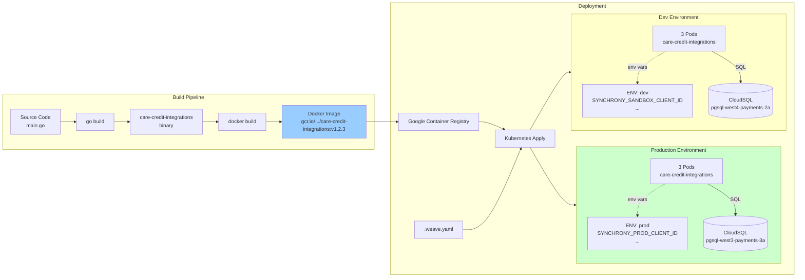

```mermaid
graph LR
    subgraph Build["Build Pipeline"]
        Code[Source Code<br/>main.go] --> Compile[go build]
        Compile --> Binary[care-credit-integrations<br/>binary]
        Binary --> Docker[docker build]
        Docker --> Image[Docker Image<br/>gcr.io/.../care-credit-integrations:v1.2.3]
    end
    
    subgraph Deploy["Deployment"]
        Image --> GCR[Google Container Registry]
        GCR --> K8s[Kubernetes Apply]
        Config[.weave.yaml] --> K8s
        
        K8s --> ProdCluster[Production Cluster<br/>wsf-prod-1-gke1-west3]
        K8s --> DevCluster[Dev Cluster<br/>wsf-dev-0-gke1-west4]
    end
    
    subgraph ProdCluster["Production Environment"]
        ProdPods[3 Pods<br/>care-credit-integrations]
        ProdDB[(CloudSQL<br/>pgsql-west3-payments-3a)]
        ProdEnv[ENV: prod<br/>SYNCHRONY_PROD_CLIENT_ID<br/>...]
        
        ProdPods -.->|env vars| ProdEnv
        ProdPods -->|SQL| ProdDB
    end
    
    subgraph DevCluster["Dev Environment"]
        DevPods[3 Pods<br/>care-credit-integrations]
        DevDB[(CloudSQL<br/>pgsql-west4-payments-2a)]
        DevEnv[ENV: dev<br/>SYNCHRONY_SANDBOX_CLIENT_ID<br/>...]
        
        DevPods -.->|env vars| DevEnv
        DevPods -->|SQL| DevDB
    end
    
    style Image fill:#99ccff
    style ProdCluster fill:#ccffcc
    style DevCluster fill:#ffffcc
```