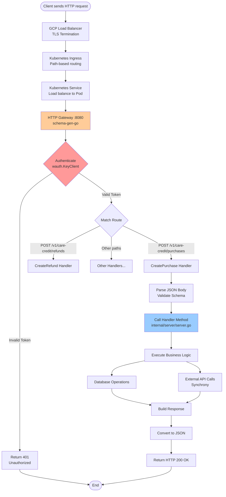

```mermaid
flowchart TD
    Start([Client sends HTTP request]) --> LB[GCP Load Balancer<br/>TLS Termination]
    LB --> Ingress[Kubernetes Ingress<br/>Path-based routing]
    Ingress --> K8sService[Kubernetes Service<br/>Load balance to Pod]
    K8sService --> Gateway[HTTP Gateway :8080<br/>schema-gen-go]
    
    Gateway --> Auth{Authenticate<br/>wauth.KeyClient}
    Auth -->|Invalid Token| Reject[Return 401<br/>Unauthorized]
    Reject --> End([End])
    
    Auth -->|Valid Token| Route{Match Route}
    Route -->|POST /v1/care-credit/purchases| CreatePurchase[CreatePurchase Handler]
    Route -->|POST /v1/care-credit/refunds| CreateRefund[CreateRefund Handler]
    Route -->|Other paths| OtherHandlers[Other Handlers...]
    
    CreatePurchase --> Parse[Parse JSON Body<br/>Validate Schema]
    Parse --> Handler[Call Handler Method<br/>internal/server/server.go]
    
    Handler --> BizLogic[Execute Business Logic]
    BizLogic --> DBOps[Database Operations]
    BizLogic --> ExtAPI[External API Calls<br/>Synchrony]
    
    DBOps --> Response[Build Response]
    ExtAPI --> Response
    
    Response --> JSON[Convert to JSON]
    JSON --> Success[Return HTTP 200 OK]
    Success --> End
    
    style Auth fill:#ff9999
    style Handler fill:#99ccff
    style Gateway fill:#ffcc99
```