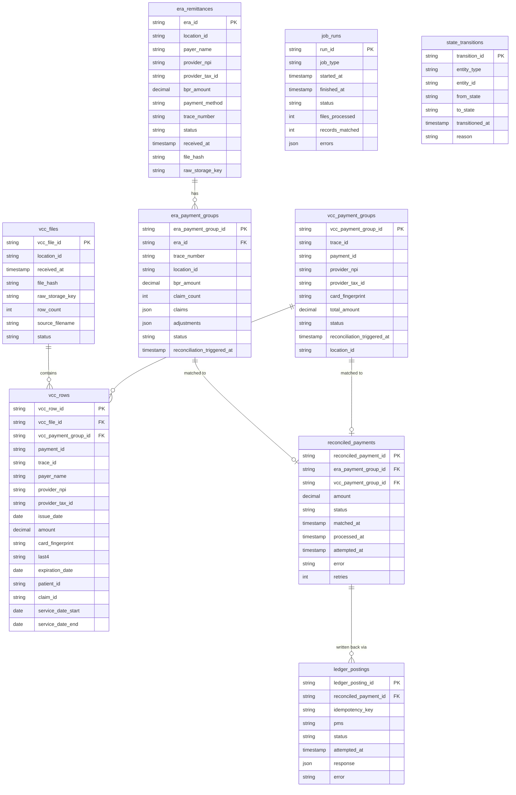

# ERD

```mermaid
erDiagram
    era_remittances {
        string era_id PK
        string location_id
        string payer_name
        string provider_npi
        string provider_tax_id
        decimal bpr_amount
        string payment_method
        string trace_number
        string status
        timestamp received_at
        string file_hash
        string raw_storage_key
    }

    era_payment_groups {
        string era_payment_group_id PK
        string era_id FK
        string trace_number
        string location_id
        decimal bpr_amount
        int claim_count
        json claims
        json adjustments
        string status
        timestamp reconciliation_triggered_at
    }

    vcc_files {
        string vcc_file_id PK
        string location_id
        timestamp received_at
        string file_hash
        string raw_storage_key
        int row_count
        string source_filename
        string status
    }

    vcc_rows {
        string vcc_row_id PK
        string vcc_file_id FK
        string vcc_payment_group_id FK
        string payment_id
        string trace_id
        string payer_name
        string provider_npi
        string provider_tax_id
        date issue_date
        decimal amount
        string card_fingerprint
        string last4
        date expiration_date
        string patient_id
        string claim_id
        date service_date_start
        date service_date_end
    }

    vcc_payment_groups {
        string vcc_payment_group_id PK
        string trace_id
        string payment_id
        string provider_npi
        string provider_tax_id
        string card_fingerprint
        decimal total_amount
        string status
        timestamp reconciliation_triggered_at
        string location_id
    }

    reconciled_payments {
        string reconciled_payment_id PK
        string era_payment_group_id FK
        string vcc_payment_group_id FK
        decimal amount
        string status
        timestamp matched_at
        timestamp processed_at
        timestamp attempted_at
        string error
        int retries
    }

    ledger_postings {
        string ledger_posting_id PK
        string reconciled_payment_id FK
        string idempotency_key
        string pms
        string status
        timestamp attempted_at
        json response
        string error
    }

    job_runs {
        string run_id PK
        string job_type
        timestamp started_at
        timestamp finished_at
        string status
        int files_processed
        int records_matched
        json errors
    }

    state_transitions {
        string transition_id PK
        string entity_type
        string entity_id
        string from_state
        string to_state
        timestamp transitioned_at
        string reason
    }

    era_remittances ||--o{ era_payment_groups : "has"
    vcc_files ||--o{ vcc_rows : "contains"
    vcc_payment_groups ||--o{ vcc_rows : "groups"
    era_payment_groups ||--o| reconciled_payments : "matched to"
    vcc_payment_groups ||--o| reconciled_payments : "matched to"
    reconciled_payments ||--o{ ledger_postings : "written back via"
```
