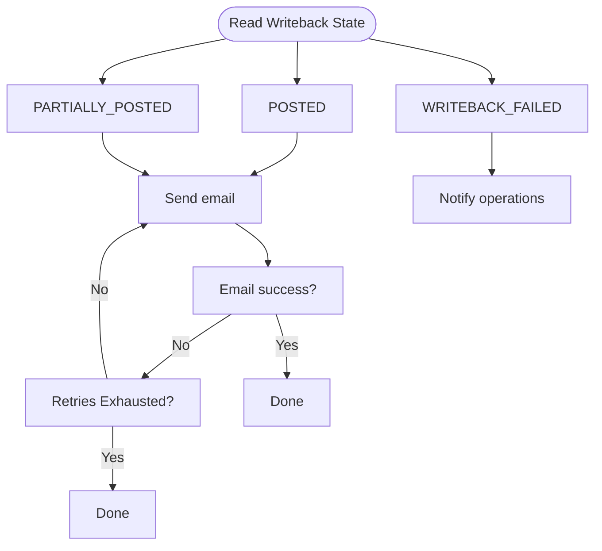

# Notifier flow

```mermaid
flowchart TD
A([Read Writeback State]) --> B[POSTED]
A --> C[PARTIALLY_POSTED]
A --> D[WRITEBACK_FAILED]
B --> E[Send email]
C --> E[Send email]
D --> F[Notify operations]
E --> G[Email success?]
G -- No --> I[Retries Exhausted?]
G -- Yes --> H[Done]
I -- Yes --> J[Done]
I -- No --> E
```