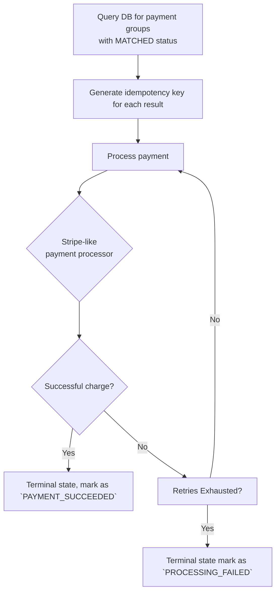

# Processor Flow

```mermaid
flowchart TD
    A[Query DB for payment groups\nwith MATCHED status] --> B[Generate idempotency key for each result]
    B --> C[Process payment]
    C --> D{Stripe-like\npayment processor}
    D --> E{Successful charge?}
    E -- Yes --> F[Terminal state, mark as `PAYMENT_SUCCEEDED`]
    E -- No --> G[Retries Exhausted?]
    G -- Yes --> I[Terminal state mark as `PROCESSING_FAILED`]
    G -- No --> C
```
