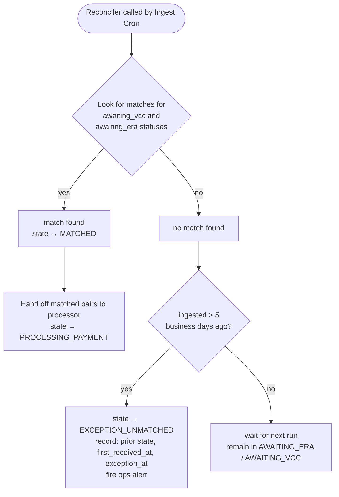

# Reconciler Flow

```mermaid
flowchart TD
    START([Reconciler called by Ingest Cron]) --> MATCH_CHECK

    MATCH_CHECK{Look for matches for\nawaiting_vcc and\nawaiting_era statuses}

    MATCH_CHECK -->|yes| MATCH_FOUND[match found\nstate → MATCHED]
    MATCH_CHECK -->|no| NO_MATCH[no match found]

    MATCH_FOUND --> HANDOFF[Hand off matched pairs to processor\nstate → PROCESSING_PAYMENT]


    NO_MATCH --> AGE_CHECK{ingested > 5\nbusiness days ago?}

    AGE_CHECK -->|yes| EXPIRE[state → EXCEPTION_UNMATCHED\nrecord: prior state, first_received_at, exception_at\nfire ops alert]
    AGE_CHECK -->|no| WAIT[wait for next run\nremain in AWAITING_ERA / AWAITING_VCC]
```
