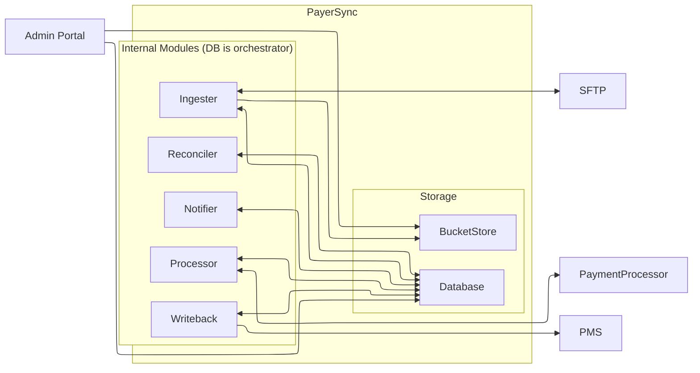

# Diagram

```mermaid
---
config:
  layout: elk
---
flowchart LR
 subgraph InternalModules["Internal Modules (DB is orchestrator)"]
        Ingester["Ingester"]
        Reconciler["Reconciler"]
        Processor["Processor"]
        Writeback["Writeback"]
        Notifier["Notifier"]
  end
 subgraph Storage["Storage"]
        DB["Database"]
        BucketStore["BucketStore"]
  end
 subgraph PayerSync["PayerSync"]
        InternalModules
        Storage
  end
    Ingester <--> SFTP["SFTP"] & DB
    Ingester --> BucketStore
    AdminPortal["Admin Portal"] --> BucketStore & DB
    Reconciler <--> DB
    Processor <--> DB & PaymentProcessor["PaymentProcessor"]
    Writeback <--> DB
    Writeback --> PMS["PMS"]
    Notifier <--> DB
```