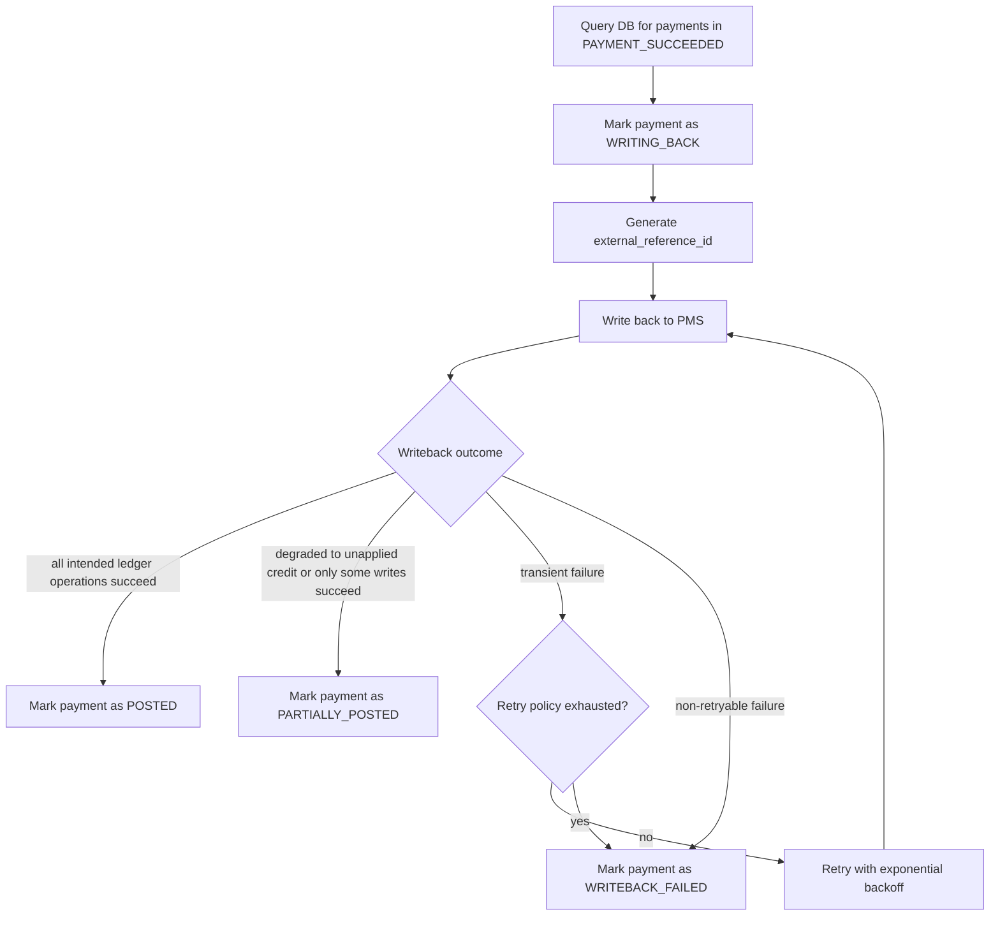

# Writeback Flow

```mermaid
flowchart TD
    A[Query DB for payments in PAYMENT_SUCCEEDED] --> B[Mark payment as WRITING_BACK]
    B --> C[Generate external_reference_id]
    C --> D[Write back to PMS]

    D --> E{Writeback outcome}
    E -->|all intended ledger operations succeed| F[Mark payment as POSTED]
    E -->|degraded to unapplied credit or only some writes succeed| G[Mark payment as PARTIALLY_POSTED]
    E -->|transient failure| H{Retry policy exhausted?}
    E -->|non-retryable failure| K[Mark payment as WRITEBACK_FAILED]

    H -->|no| I[Retry with exponential backoff]
    I --> D
    H -->|yes| K
```
