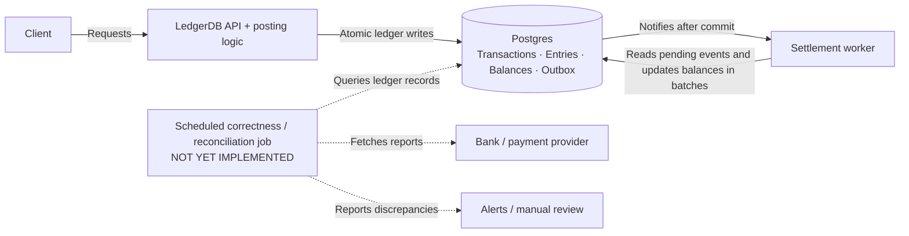

```mermaid
flowchart LR
    Client -->|Requests| API["LedgerDB API + posting logic"]
    API -->|Atomic ledger writes| DB[("Postgres<br/>Transactions · Entries · Balances · Outbox")]

    DB -->|Notifies after commit| Worker["Settlement worker"]
    Worker -->|Reads pending events and updates balances in batches| DB

    Job["Scheduled correctness / reconciliation job<br/>NOT YET IMPLEMENTED"]
    Job -.->|Queries ledger records| DB
    Job -.->|Fetches reports| External["Bank / payment provider"]
    Job -.->|Reports discrepancies| Review["Alerts / manual review"]
```